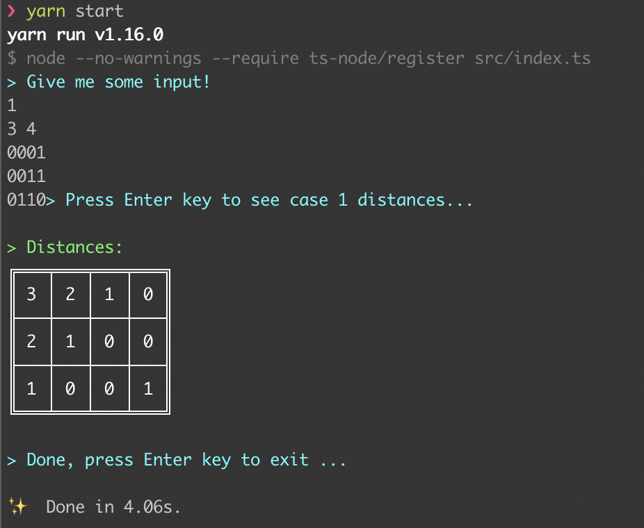

## Bitmap distances

Computation of distances for each Off bit to the nearest On bit in a Bitmap
**NodeJS + TypeScript + Jest**



### Run instructions

```bash
# install dependencies
$ yarn
$ yarn start
```

### Scripts included

- #### Jest testing

```bash
# run tests with coverage
$ yarn test

# run test in Jest watch mode (no coverage)
$ yarn test:watch
```

- #### Build js code from TS

```bash
# build javascript code at `dist` folder (check tsconfig.json)
$ yarn build

# Build and keep listening for changes to rebuild
$ yarn build:watch
```
